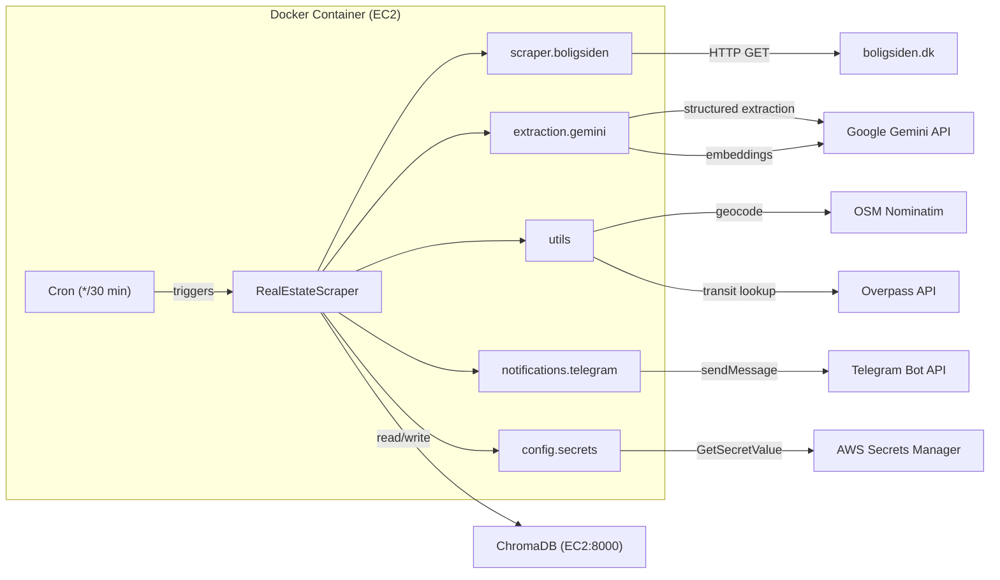
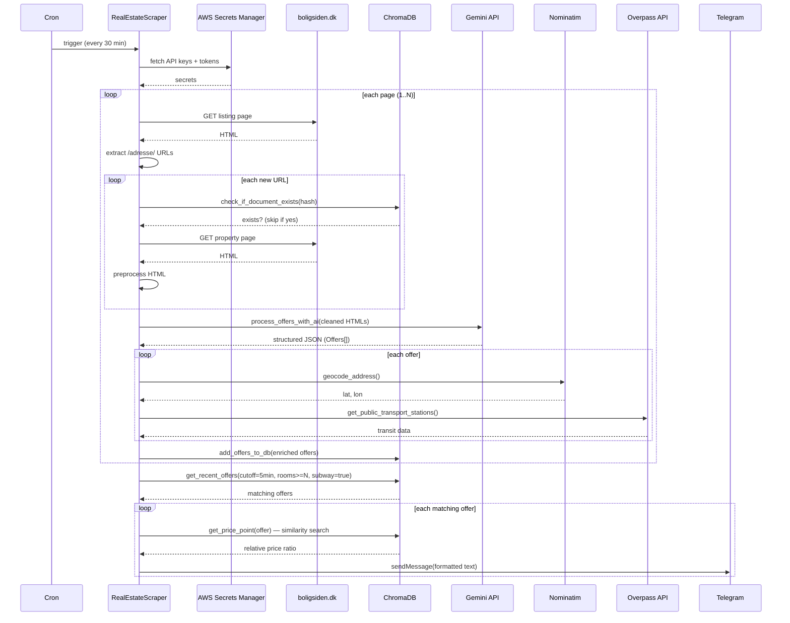
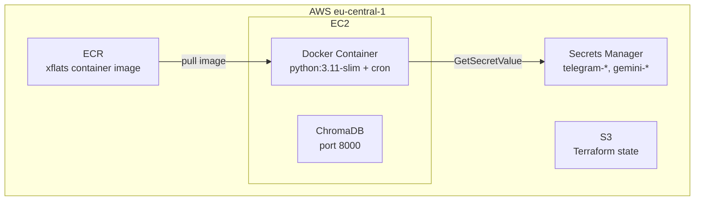
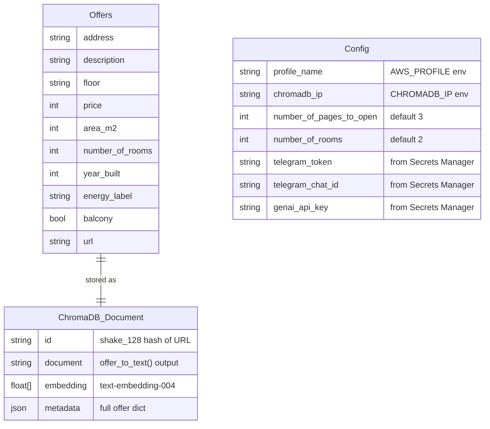

# xFlats Architecture

## 1. Overview

xFlats is an automated real estate monitoring system for Copenhagen. Every 30 minutes a cron-triggered Docker container scrapes property listings from boligsiden.dk, extracts structured data via Google Gemini AI, stores listings with embeddings in ChromaDB for deduplication and similarity search, enriches them with geocoding and public transport data, then sends matching new listings as Telegram notifications with a relative price indicator.

## 2. System Architecture

High-level component and external service dependency map.

## 3. Components

| Module | Responsibility | Key Functions / Classes | Dependencies |
|--------|---------------|------------------------|--------------|
| `main.py` | Orchestration — scrape, extract, store, notify | `RealEstateScraper`, `run()`, `scrape_historical_listings()` | All modules below |
| `scraper.boligsiden` | HTML fetching + parsing from boligsiden.dk | `fetch_html()`, `fetch_and_preprocess()`, `extract_adresse_urls()`, `check_crawl_permission()` | requests, BeautifulSoup, pydantic |
| `extraction.gemini` | AI structured extraction + embeddings | `process_offers_with_ai()`, `GeminiEmbeddingFunction`, `Offers` model | google-genai, chromadb, pydantic |
| `storage.chromadb` | Vector DB operations — store, query, dedup | `setup_vector_database()`, `add_offers_to_db()`, `get_recent_offers()`, `get_price_point()` | chromadb |
| `notifications.telegram` | Format + send Telegram messages | `send_telegram_notifications()`, `create_offer_text()` | requests, storage.chromadb |
| `config.secrets` | Load secrets from AWS Secrets Manager + env vars | `Config`, `get_secret()` | boto3 |
| `utils` | Geocoding, transit lookup, URL cleanup | `geocode_address()`, `get_public_transport_stations()`, `remove_url_parameters()` | requests |

## 4. Data Flow

Step-by-step data flow from cron trigger through scraping, extraction, enrichment, storage, to Telegram notification.

### Steps

1. **Cron fires** — `*/30 * * * *` runs `python -m xflats.main`
2. **Config loads** — `Config()` pulls secrets from AWS Secrets Manager (Telegram token, Gemini API key)
3. **ChromaDB connects** — `setup_vector_database()` to EC2-hosted ChromaDB on port 8000
4. **Page scraping** — For each page, fetch listing HTML, extract `/adresse/` URLs
5. **Dedup check** — Hash each URL (`shake_128`), skip if already in ChromaDB
6. **HTML fetch + preprocess** — Two-request strategy: first 10KB to detect 404, then full fetch. Strip nav/scripts/styles, keep JSON-LD
7. **AI extraction** — Batch send cleaned HTMLs to `gemini-2.0-flash` with structured output schema (`ListOfOffers`). Temp=0.1
8. **Enrichment** — Geocode via Nominatim, query Overpass API for subway/bus/train stations within 700m
9. **Store** — Upsert into ChromaDB with Gemini `text-embedding-004` embeddings
10. **Query recent** — Get offers from last 5 minutes with subway access and room count >= threshold
11. **Price point** — For each match, find 5 similar offers from last 90 days, compute price ratio
12. **Notify** — Sort by price ratio (cheapest first), send each to Telegram

## 5. Infrastructure

AWS infrastructure layout.

| Resource | Purpose |
|----------|---------|
| **EC2** | Hosts Docker container (cron job) + ChromaDB server |
| **ECR** | Container registry for xflats image |
| **Secrets Manager** | Stores `telegram-274181059559` (TOKEN, CHAT_ID) and `gemini-274181059559` (GOOGLE_API_KEY) |
| **S3** | Terraform remote state backend |
| **IAM** | EC2 instance role with ECR pull + Secrets Manager read |

### Docker

- Base: `python:3.11-slim`
- Deps installed via `uv sync --frozen --no-dev`
- Cron runs `uv run python -m xflats.main` every 30 minutes
- Logs to `/var/log/cron.log`

## 6. Data Models

Key data models and their relationship.

| Model | Location | Purpose |
|-------|----------|---------|
| `Offers` | `extraction/gemini.py` | Pydantic model — Gemini structured output schema |
| `ListOfOffers` | `extraction/gemini.py` | Wrapper for batch extraction response |
| `Config` | `config/secrets.py` | App configuration — env vars + AWS secrets |
| ChromaDB document | `storage/chromadb.py` | Stored with id (URL hash), text document, embedding, full metadata dict |

### Enrichment fields added at runtime

| Field | Source |
|-------|--------|
| `id` | `shake_128` hash of cleaned URL |
| `version` | Constant (`OFFER_VERSION = 2`) |
| `create_date` | UTC timestamp at processing time |
| `lat`, `long` | OSM Nominatim geocoding |
| `subways`, `trains`, `light_rails`, `bus_stations`, `ferry_terminals` | Overpass API (bool flags) |
| `public_transport_text` | Overpass API (formatted string) |
| `price_point` | Computed at notification time — offer price / mean of 5 similar offers from last 90 days |

## 7. Design Decisions

| Decision | Rationale |
|----------|-----------|
| **Gemini 2.0 Flash for extraction** | Fast, cheap, supports structured JSON output with Pydantic schema enforcement. Temp=0.1 for determinism |
| **Gemini text-embedding-004** | Native integration with extraction client. Single API key for both tasks |
| **ChromaDB** | Lightweight vector DB, easy self-hosting on EC2. Supports metadata filtering + semantic similarity for price comparison |
| **Cron (every 30 min) vs event-driven** | No webhook available from boligsiden.dk. Polling is the only option. 30-min interval balances freshness vs API costs |
| **Two-request fetch strategy** | First request reads 10KB to detect 404/not-found pages cheaply. Avoids full-page download for dead listings |
| **URL hashing for dedup** | `shake_128` of clean URL as ChromaDB document ID. Simple, deterministic, collision-resistant |
| **Price point as ratio** | Relative metric (offer price / avg of 5 similar). Immediately shows if listing is above or below market |
| **Overpass API for transit** | Free, open data. 700m radius captures walkable transit options |
| **AWS Secrets Manager** | No secrets in code or env files. Single source of truth for credentials |
| **Docker + cron** | Simple deployment model. No orchestrator needed for single periodic job |
